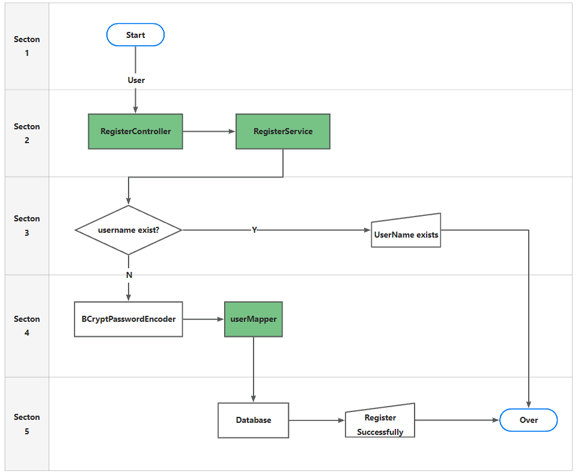
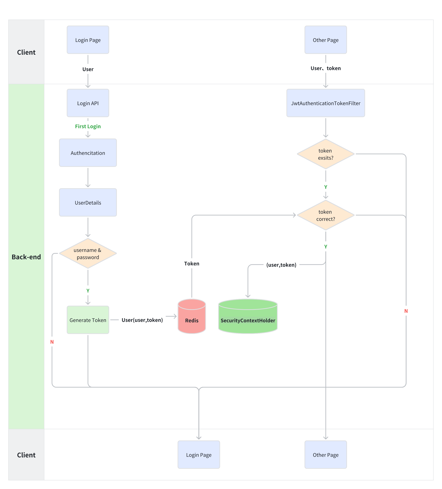

# Authentication

## 1. Register

### 1.1 Password encrypted storage

In actual projects, we will not store the password in clear text in the database..

The **PasswordEncoder** used by default requires the password format in the database to br `{id}password`.
It will determine the password based on the ID Encryption.

But we generally don't use this approach. So we need to replace the PasswordEncoder.

We generally use **BCryptPasswordEncoder** provided by SpringSecurity.

Wwe only need to inject the BCryptPasswordEncoder object into the Spring container,
and SpringSecurity will use this PasswordEncoder to check the password.

We can define a SpringSecurity configuration class, and it needs to inherit from
WebSecurityConfigurerAdapter.

### 1.2 Diagram

## 2. Login

### 2.1 Diagram

1. Request to **login**.
    - Generate a token and store it in the redis.
    - Return the token to client.
2. Request **other** page.
    - Check if token exists, if not, return to login page.
    - Check if token exist in redis in **JwtAuthenticationTokenFilter**.
        - If the token is invalid, response an error message to client.
    - Save `User(user,token)` in **SecurityContextHolder**.
    - Pass.

## 3. Logout

1. Process of the logout.
    - Delete the token in redis.

