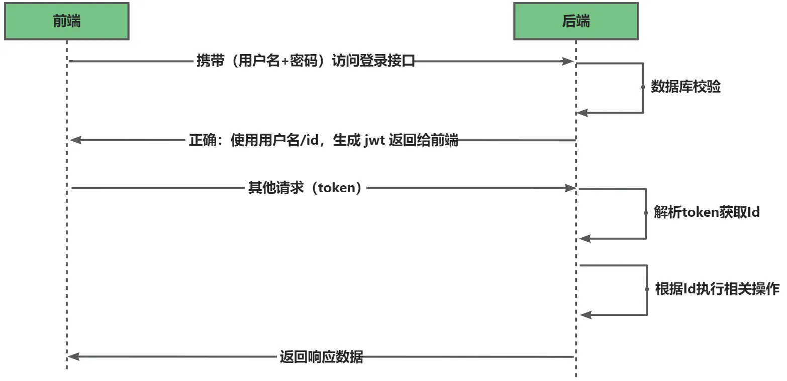
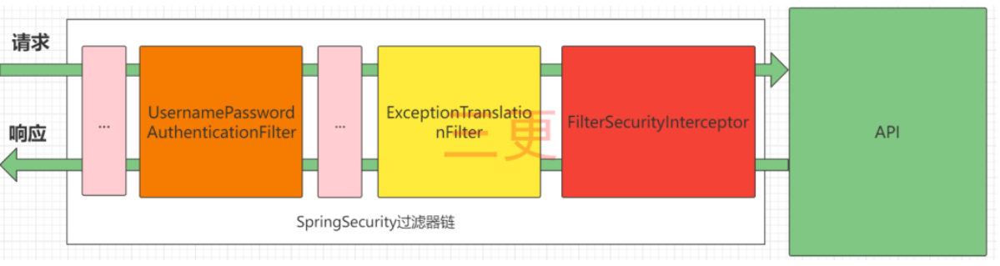
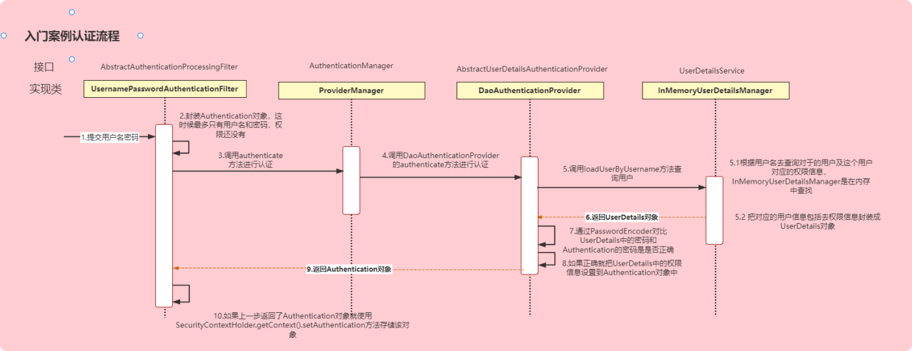

# SpringSecurity

Spring Security is a security management framework in the Spring family. Compared to Shiro, it provides richer functions
and community resources than Shiro.

Generally, medium to large projects use SpringSecurity as a security framework.

There are more small projects with Shiro, because compared to SpringSecurity Shiro is easier to get started.

Web applications typically require **authentication** and **authorization**.

1. **Authentication**: Verify that current access system is the system of the project, and which user is it?
2. **Authorization**: After authentication, determine whether current user hash permission to perform a certain action.

## 1. Login Process

## 2. SpringSecurity complete process

SpringSecurity is essentially a chain of filters that provide a variety of functions.

The only core filters are shown, and the other non-core filters are not shown in the figure.

1. **UsernamePasswordAuthenticationFilter**: Responsible for processing the login request.
2. **ExceptionTranslationFilter**：Handles any AccessDeniedException and AuthenticationException.
3. **FilterSecurityInterceptor**：A filter for responsible for permission verification.

## 3. Detailed explanation of the certification process

1. **Authentication Interface**:
2. **AuthenticationManager Interface**: The method of authentication is defined.
3. **UserDetailsService Interface**:
    - The core interface for loading user information.
    - It defines a method to query user information based on username.
4. **UserDetails Interface**:
    - Provide core user information.
    - UserDetailsService obtains and processes user information based on username,
      and returns it as a UserDetails object
    - This information is encapsulated into an Authentication Object.

