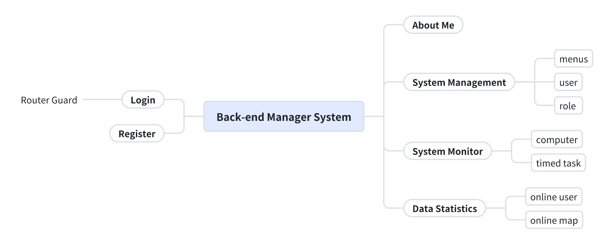
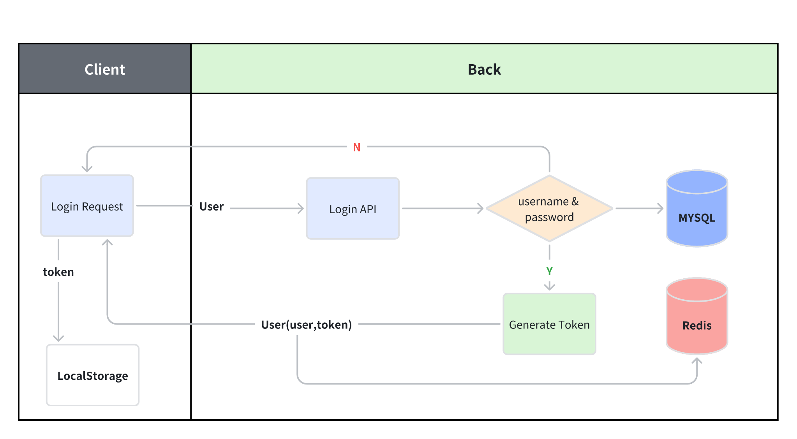
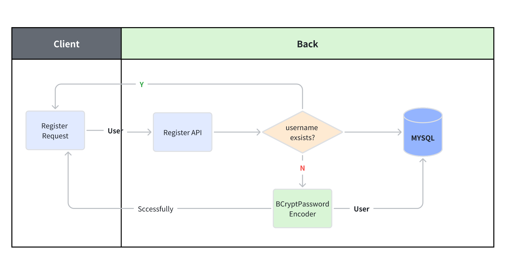
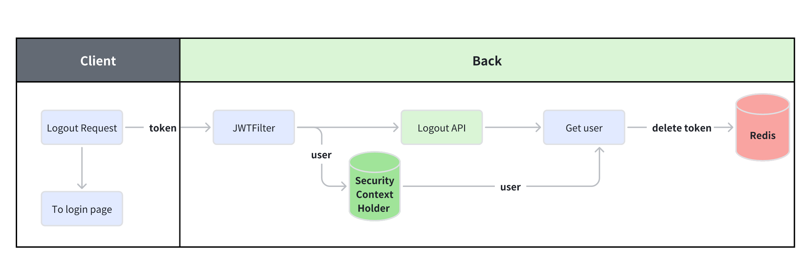

# Requirements Analysis

## 1.Requirements

***

## 2.Developing

### 2.1 Login

1. Check if the username or password exists.
2. Generate token.
3. Store the user and token in Redis.
4. Return token.
5. Front stores the token in LocalStorage.

### 2.2 Register

### 2.3 Logout

1. JWTFilter:
    - Parse token, get user and save it to **SecurityContextHolder**.
2. Logout API:
    - get user from **SecurityContextHolder**.
    - delete user and token from Redis.
