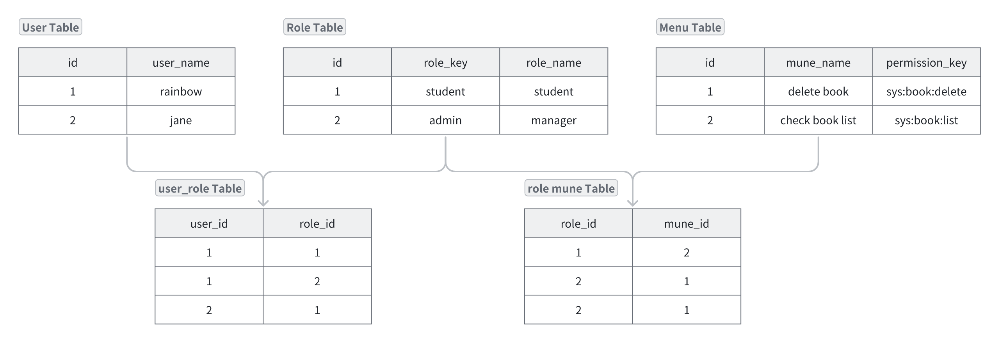
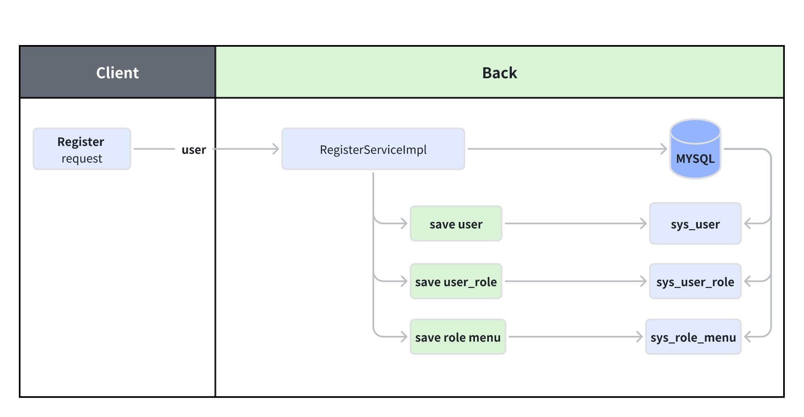

# Authorization

## 1. 🥚Permission System Management

Permission System aims to control the user's access to and operation of system resources(e.g., functions, data)
based on the user's role in the whole system.

### 1.1 Example of a library system.

User Role Definition:

1. **Student**: Borrow, renew, search and return books.
2. **Library Manager**: In addition to having the permission of the student, them also can add, delete, modify books and
   manage user accounts.

For each user role, the system should set the `corresponding`(相应的) permission set in advance.

*** 

## 2. 🍳Quick Start

### 2.1 Login Request


1. LoginUser

   ```java
   
   @Data
   @NoArgsConstructor
   public class LoginUser implements UserDetails {
       private User user;
   
       private List<String> permissions;
   
       // Do not save to Redis.
       @JSONField(serialize = false)
       private List<GrantedAuthority> authorities;
   
       public LoginUser(User user, List<String> permissions) {
           this.user = user;
           this.permissions = permissions;
       }
   
   
       @Override
       public Collection<? extends GrantedAuthority> getAuthorities() {
           if (authorities != null) {
               return authorities;
           }
           // Store the permission from list permissions to authorities.
           authorities = permissions.stream().
                   map(SimpleGrantedAuthority::new)
                   .collect(Collectors.toList());
   
           return authorities;
       }
   
       //  ......
   }
   ```

2. UserDetailsServiceImpl

   ```java
   
   @Service
   public class UserDetailsServiceImpl implements UserDetailsService {
       @Autowired
       private UserMapper userMapper;
   
       /**
        * Verify username and password with database.
        *
        * @return UserDetails
        */
       @Override
       public UserDetails loadUserByUsername(String username) throws UsernameNotFoundException {
           // Query user information based on the username
           LambdaQueryWrapper<User> wrapper = new LambdaQueryWrapper<>();
           wrapper.eq(User::getUserName, username);
   
           // Throw the exception if the username or password is incorrect.
           User user = Optional.ofNullable(userMapper.selectOne(wrapper))
                   .orElseThrow(() -> new UsernameNotFoundException("The user name or password is incorrect"));
   
           // Get permissions of the current user from MYSQL.
           List<String> list = new ArrayList<>(Arrays.asList("test", "admin"));  //  ************************
   
           return new LoginUser(user, list);
       }
   }
   ```

3. LoginServiceImpl

   ```java
   
   @Service
   public class LoginServiceImpl implements LoginService {
       @Resource
       private AuthenticationManager authenticationManager;
       @Resource
       private RedisCache redisCache;
       private static final Logger logger = LogManager.getLogger(LoginServiceImpl.class);
   
   
       /**
        * LOGIN
        * @param user
        * @return
        */
       @Override
       public ResponseResult login(User user) {
           // Create an authentication token with the user's credentials.
   
           // Get the authenticationToken from   UserDetailServiceImpl   .******************
   
           UsernamePasswordAuthenticationToken authenticationToken = new
                   UsernamePasswordAuthenticationToken(user.getUserName(), user.getPassword());
   
           try {
               // User authentication.
               Authentication authenticate =
                       authenticationManager.authenticate(authenticationToken);
   
               // Authentication failure handling.
               if (Objects.isNull(authenticate)) {
                   throw new RuntimeException("username or password is incorrect.");
               }
   
               // Generate a JWT using the user's ID.
               LoginUser loginUser = (LoginUser) authenticate.getPrincipal();
               String userId = loginUser.getUser().getId().toString();
               String jwt = JwtUtil.createJWT(userId);
   
               // Store the authentication information in Redis.
               redisCache.setCacheObject("login:" + userId, loginUser);
   
               // Return the JWT to the client.
               HashMap<String, String> map = new HashMap<>();
               map.put("token", jwt);
               // Return a response result containing the JWT and other information.
               return new ResponseResult<>(200, "登陆成功", map);
   
           } catch (Exception e) {
               logger.error("An error occurred during user registration: {}", e.getMessage());
               return new ResponseResult<>(500, "An internal server error occurred while processing your request.");
           }
       }
   }
   ```

### 2.2 Other Request


1. Security Config

   ```java
   @Configuration
   @EnableGlobalMethodSecurity(prePostEnabled = true)   //Open the MethodSecurity.
   public class SecurityConfig extends WebSecurityConfigurerAdapter {
       // .....
   
   }
   ```

2. JwtAuthenticationTokenFilter

   ```java
   
   @Component
   public class JwtAuthenticationTokenFilter extends OncePerRequestFilter {
       @Autowired
       private RedisCache redisCache;
   
       private static final Logger logger = LogManager.getLogger(LoginServiceImpl.class);
   
       @Override
       protected void doFilterInternal(HttpServletRequest request, HttpServletResponse response, FilterChain filterChain) throws ServletException, IOException {
           // ...Other Code....
   
           // Store in SecurityContextHolder.
           UsernamePasswordAuthenticationToken authenticationToken =
                    // First is user information，second is certification, third is permissions.
                   new UsernamePasswordAuthenticationToken(loginUser, null, loginUser.getAuthorities());
   
           SecurityContextHolder.getContext().setAuthentication(authenticationToken);
   
   
           // Pass interception.
           filterChain.doFilter(request, response);
       }
   
   }
   ```

2. testController

   ```java
   
   @RestController
   @RequestMapping("test")
   public class testContoller {
   
       @RequestMapping("hello")
       @PreAuthorize("hasAuthority('test')")   // Access to the api, if current user's permission includes "test"
       public String hello() {
           return "hello";
       }
   
   }
   ```

*** 

## 3. 🥪RBAC Permission Model

RBAC(Role-Based Access Control) permission model is a classic model, that is based on role permission control.

The model consists of the following five main components:



In the above, we have implemented basic permission control, but in the actual project, permission authentication is only
part of it, we need to manage permissions, and we need to assign permissions.

1. Get permission

   ```java
   
   @Service
   public class UserDetailsServiceImpl implements UserDetailsService {
       @Autowired
       private UserMapper userMapper;
   
       /**
        * Verify username and password with database.
        *
        * @return UserDetails
        */
       @Override
       public UserDetails loadUserByUsername(String username) throws UsernameNotFoundException {
           // .......
           // Get permissions of the current user from MYSQL.
           List<String> list = new ArrayList<>(Arrays.asList("test", "admin"));  //  *****Get permissions of the current user from MYSQL.
   
           return new LoginUser(user, list);
       }
   }
   ```

2. Ger permission API

   ```java

   @RestController
   @RequestMapping("test")
   public class testContoller {

    @RequestMapping("hello")
    @PreAuthorize("hasAuthority('test')")   // Access to the api, if current user's permission includes "test"
    public String hello() {
        return "hello";
    }

   }
   ```

### 3.1 Create data table

1. **role** table

   ```sql
   CREATE TABLE `sys_role`
   (
       `id`          bigint(20) NOT NULL AUTO_INCREMENT,
       `name`        varchar(128) DEFAULT NULL,
       `role_key`    varchar(100) DEFAULT NULL COMMENT '角色权限字符串',
       `status`      char(1)      DEFAULT '0' COMMENT '角色状态（0正常 1停用）',
       `del_flag`    int(1) DEFAULT '0' COMMENT 'del_flag',
       `create_by`   bigint(200) DEFAULT NULL,
       `create_time` datetime     DEFAULT NULL,
       `update_by`   bigint(200) DEFAULT NULL,
       `update_time` datetime     DEFAULT NULL,
       `remark`      varchar(500) DEFAULT NULL COMMENT '备注',
       PRIMARY KEY (`id`)
   ) ENGINE=InnoDB AUTO_INCREMENT=3 DEFAULT CHARSET=utf8mb4 COMMENT='User table';
   ```

2. **user_role** table

   ```sql
   CREATE TABLE `sys_user_role`
   (
       `user_id` bigint(200) NOT NULL AUTO_INCREMENT COMMENT 'user id',
       `role_id` bigint(200) NOT NULL DEFAULT '0' COMMENT 'role id',
       PRIMARY KEY (`user_id`, `role_id`)
   ) ENGINE=InnoDB DEFAULT CHARSET=utf8mb4;
   
   ```

3. **menu** table

   ```sql
   CREATE TABLE `sys_menu`
   (
       `id`          bigint(20) NOT NULL AUTO_INCREMENT,
       `menu_name`   varchar(64) NOT NULL DEFAULT 'NULL' COMMENT '菜单名',
       `path`        varchar(200)         DEFAULT NULL COMMENT '路由地址',
       `component`   varchar(255)         DEFAULT NULL COMMENT '组件路径',
       `visible`     char(1)              DEFAULT '0' COMMENT '菜单状态（0显示 1隐藏）',
       `status`      char(1)              DEFAULT '0' COMMENT '菜单状态（0正常 1停用）',
       `perms`       varchar(100)         DEFAULT NULL COMMENT '权限标识',
       `icon`        varchar(100)         DEFAULT '#' COMMENT '菜单图标',
       `create_by`   bigint(20) DEFAULT NULL,
       `create_time` datetime             DEFAULT NULL,
       `update_by`   bigint(20) DEFAULT NULL,
       `update_time` datetime             DEFAULT NULL,
       `del_flag`    int(11) DEFAULT '0' COMMENT '是否删除（0未删除 1已删除）',
       `remark`      varchar(500)         DEFAULT NULL COMMENT '备注',
       PRIMARY KEY (`id`)
   ) ENGINE=InnoDB AUTO_INCREMENT=2 DEFAULT CHARSET=utf8mb4 COMMENT='权限表';
   ```

4. **role_menu** table
   ```sql
   
   CREATE TABLE `sys_role_menu`
   (
       `role_id` bigint(200) NOT NULL AUTO_INCREMENT COMMENT '角色ID',
       `menu_id` bigint(200) NOT NULL DEFAULT '0' COMMENT '菜单id',
       PRIMARY KEY (`role_id`, `menu_id`)
   ) ENGINE=InnoDB AUTO_INCREMENT=2 DEFAULT CHARSET=utf8mb4;
   ```

5. Test data

   ```sql
   insert into sys_role
   values (1, '普通用户', 'user', 0, 0, default, default, default, default, default),
          (2, '管理员', 'admin', 0, 0, default, default, default, default, default);

   
   insert into sys_menu
   values (1, '部门管理', 'dept', 'system/dept/index', 0, 0, 'system:dept:list', '#', default, default, default, default,
           default, default),
          (2, '测试', 'test', 'system/test/index', 0, 0, 'system:test:list', '#', default, default, default, default,
           default, default)
   ```

### 3.2 Register and assign permissions



1. **RegisterServiceImpl**

```java

```

### 3.3 Get permission API
