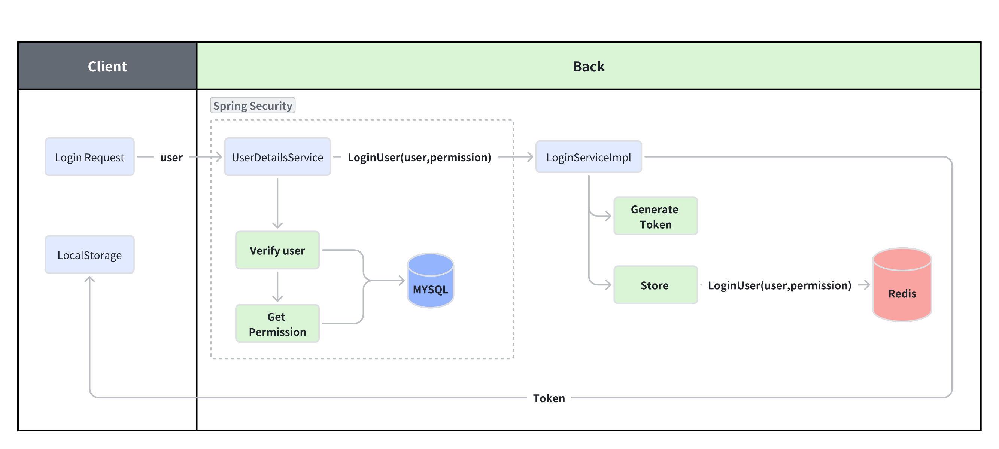
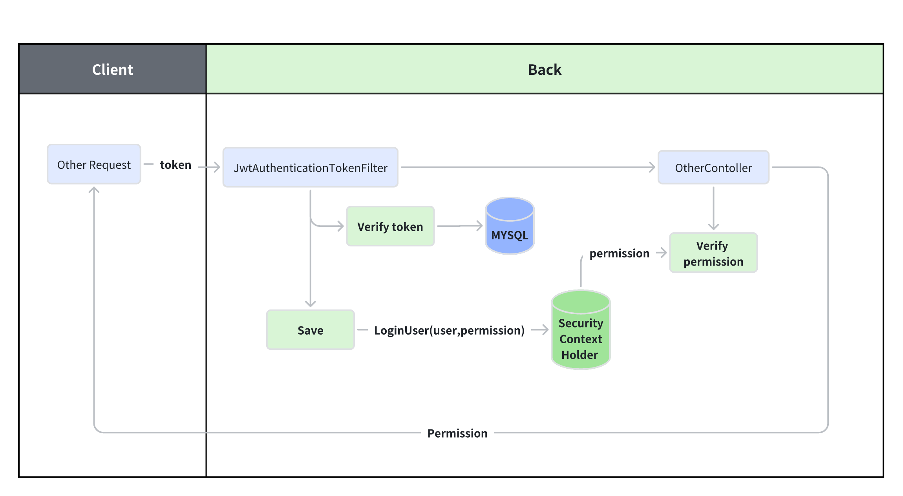

# Authorization

## 1. 🥚Permission System Management

Permission System aims to control the user's access to and operation of system resources(e.g., functions, data)
based on the user's role in the whole system.

### 1.1 Example of a library system.

User Role Definition:

1. **Student**: Borrow, renew, search and return books.
2. **Library Manager**: In addition to having the permission of the student, them also can add, delete, modify books and
   manage user accounts.

For each user role, the system should set the `corresponding`(相应的) permission set in advance.

*** 

## 2. 🍳Quick Start

### 2.1 Login Request



1. LoginUser

   ```java
   
   @Data
   @NoArgsConstructor
   public class LoginUser implements UserDetails {
       private User user;
   
       private List<String> permissions;
   
       // Do not save to Redis.
       @JSONField(serialize = false)
       private List<GrantedAuthority> authorities;
   
       public LoginUser(User user, List<String> permissions) {
           this.user = user;
           this.permissions = permissions;
       }
   
   
       @Override
       public Collection<? extends GrantedAuthority> getAuthorities() {
           if (authorities != null) {
               return authorities;
           }
           // Store the permission from list permissions to authorities.
           authorities = permissions.stream().
                   map(SimpleGrantedAuthority::new)
                   .collect(Collectors.toList());
   
           return authorities;
       }
   
       //  ......
   }
   ```

2. UserDetailsServiceImpl

   ```java
   
   @Service
   public class UserDetailsServiceImpl implements UserDetailsService {
       @Autowired
       private UserMapper userMapper;
   
       /**
        * Verify username and password with database.
        *
        * @return UserDetails
        */
       @Override
       public UserDetails loadUserByUsername(String username) throws UsernameNotFoundException {
           // Query user information based on the username
           LambdaQueryWrapper<User> wrapper = new LambdaQueryWrapper<>();
           wrapper.eq(User::getUserName, username);
   
           // Throw the exception if the username or password is incorrect.
           User user = Optional.ofNullable(userMapper.selectOne(wrapper))
                   .orElseThrow(() -> new UsernameNotFoundException("The user name or password is incorrect"));
   
           // Get permissions of the current user from MYSQL.
           List<String> list = new ArrayList<>(Arrays.asList("test", "admin"));  //  ************************
   
           return new LoginUser(user, list);
       }
   }
   
   
   ```

3. LoginServiceImpl

   ```java
   
   @Service
   public class LoginServiceImpl implements LoginService {
       @Resource
       private AuthenticationManager authenticationManager;
       @Resource
       private RedisCache redisCache;
       private static final Logger logger = LogManager.getLogger(LoginServiceImpl.class);
   
   
       /**
        * LOGIN
        * @param user
        * @return
        */
       @Override
       public ResponseResult login(User user) {
           // Create an authentication token with the user's credentials.
   
           // Get the authenticationToken from   UserDetailServiceImpl   .******************
   
           UsernamePasswordAuthenticationToken authenticationToken = new
                   UsernamePasswordAuthenticationToken(user.getUserName(), user.getPassword());
   
           try {
               // User authentication.
               Authentication authenticate =
                       authenticationManager.authenticate(authenticationToken);
   
               // Authentication failure handling.
               if (Objects.isNull(authenticate)) {
                   throw new RuntimeException("username or password is incorrect.");
               }
   
               // Generate a JWT using the user's ID.
               LoginUser loginUser = (LoginUser) authenticate.getPrincipal();
               String userId = loginUser.getUser().getId().toString();
               String jwt = JwtUtil.createJWT(userId);
   
               // Store the authentication information in Redis.
               redisCache.setCacheObject("login:" + userId, loginUser);
   
               // Return the JWT to the client.
               HashMap<String, String> map = new HashMap<>();
               map.put("token", jwt);
               // Return a response result containing the JWT and other information.
               return new ResponseResult<>(200, "登陆成功", map);
   
           } catch (Exception e) {
               logger.error("An error occurred during user registration: {}", e.getMessage());
               return new ResponseResult<>(500, "An internal server error occurred while processing your request.");
           }
       }
   }
   ```

### 2.2 Other Request



1. Security Config

   ```java
   @Configuration
   @EnableGlobalMethodSecurity(prePostEnabled = true)   //Open the MethodSecurity.
   public class SecurityConfig extends WebSecurityConfigurerAdapter {
       // .....
   
   }
   ```

2. JwtAuthenticationTokenFilter

   ```java
   
   @Component
   public class JwtAuthenticationTokenFilter extends OncePerRequestFilter {
       @Autowired
       private RedisCache redisCache;
   
       private static final Logger logger = LogManager.getLogger(LoginServiceImpl.class);
   
       @Override
       protected void doFilterInternal(HttpServletRequest request, HttpServletResponse response, FilterChain filterChain) throws ServletException, IOException {
           // ...Other Code....
   
           // Store in SecurityContextHolder.
           UsernamePasswordAuthenticationToken authenticationToken =
                    // First is user information，second is certification, third is permissions.
                   new UsernamePasswordAuthenticationToken(loginUser, null, loginUser.getAuthorities());
   
           SecurityContextHolder.getContext().setAuthentication(authenticationToken);
   
   
           // Pass interception.
           filterChain.doFilter(request, response);
       }
   
   }
   ```

2. testController

   ```java
   
   @RestController
   @RequestMapping("test")
   public class testContoller {
   
       @RequestMapping("hello")
       @PreAuthorize("hasAuthority('test')")   // Access to the api, if current user's permission includes "test"
       public String hello() {
           return "hello";
       }
   
   }
   ```

*** 

## 3. 🥪RBAC Permission Model