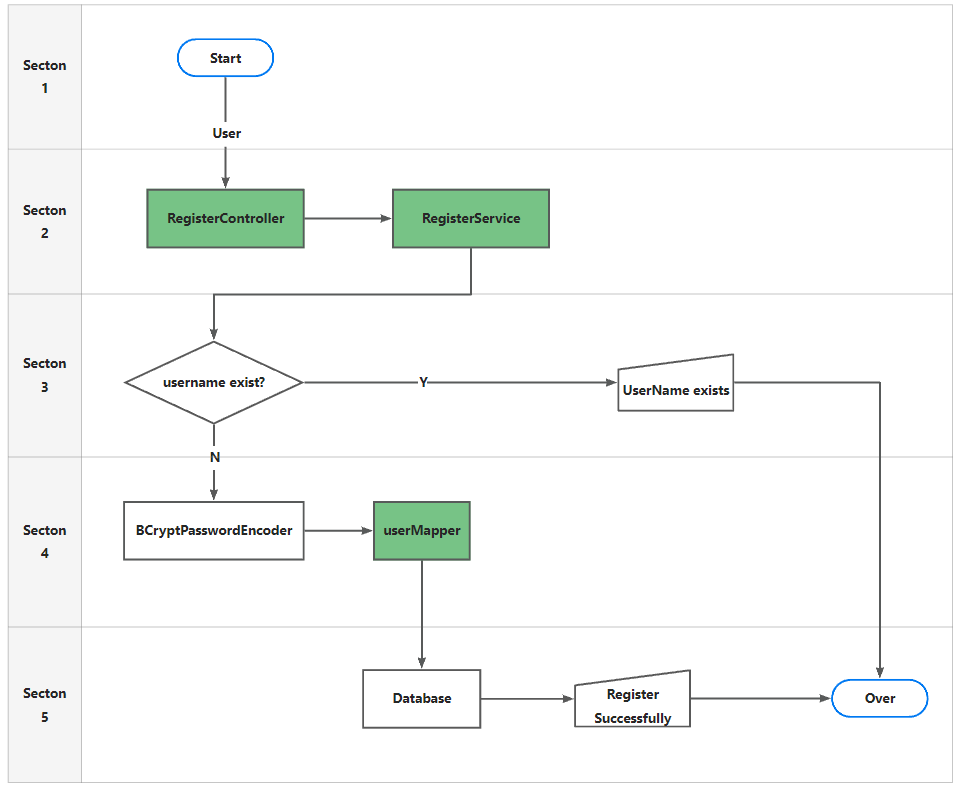

# Authentication

## Register



1. RegisterController.java
    ```java
    public class RegisterController {
        @Autowired
        private RegisterService registerService;
    
    
        @PostMapping("register")
        public ResponseResult register(@RequestBody User user) {
            return registerService.register(user);
        }
    
    }
    ```
   
2. RegisterService.java
   ```java
   @Service
   public class RegisterServiceImpl implements RegisterService {
       private static final Logger logger = LogManager.getLogger(RegisterServiceImpl.class);
       @Autowired
       private UserMapper userMapper;
       @Transactional(rollbackFor = Exception.class) 
       @Override
       public ResponseResult register(User user) {
           try {
               // Check if username or password is null.
               if (user.getUserName() == null || user.getPassword() == null) {
                   throw new IllegalArgumentException("username or password is null");
               }
   
               LambdaQueryWrapper<User> queryWrapper = new LambdaQueryWrapper<>();
               queryWrapper.eq(User::getUserName, user.getUserName());
               User userExist = userMapper.selectOne(queryWrapper);
   
               // Check if username already exists.
               if (userExist != null) {
                   throw new IllegalStateException("username already exists");
               } else {
                   // Encrypt password.
                   BCryptPasswordEncoder bCryptPasswordEncoder = new BCryptPasswordEncoder();
                   String encryptedPassword = bCryptPasswordEncoder.encode(user.getPassword());
                   user.setPassword(encryptedPassword);
   
                   // Insert user into database.
                   int insert = userMapper.insert(user);
   
                   if (insert <= 0) {
                       throw new RuntimeException("Failed to insert user into database");
                   }
   
                   return new ResponseResult(200, "Registration successful");
               }
           } catch (Exception e) {
               logger.error("An error occurred during user registration: {}", e.getMessage());
               return new ResponseResult(500, "An internal server error occurred while processing your request.");
           }
       }
   }
   ```


## 2. Login

### 2.1 Password encrypted storage

In actual projects, we will not store the password in clear text in the database..

The **PasswordEncoder** used by default requires the password format in the database to br `{id}password`.
It will determine the password based on the ID Encryption.

But we generally don't use this approach. So we need to replace the PasswordEncoder.

We generally use **BCryptPasswordEncoder** provided by SpringSecurity.

Wwe only need to inject the BCryptPasswordEncoder object into the Spring container,
and SpringSecurity will use this PasswordEncoder to check the password.

We can define a SpringSecurity configuration class, and it needs to inherit from
WebSecurityConfigurerAdapter.

